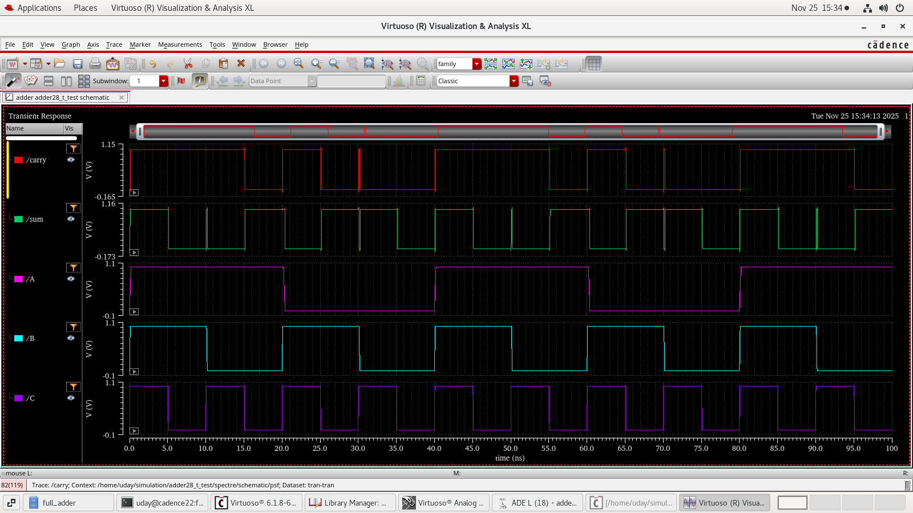
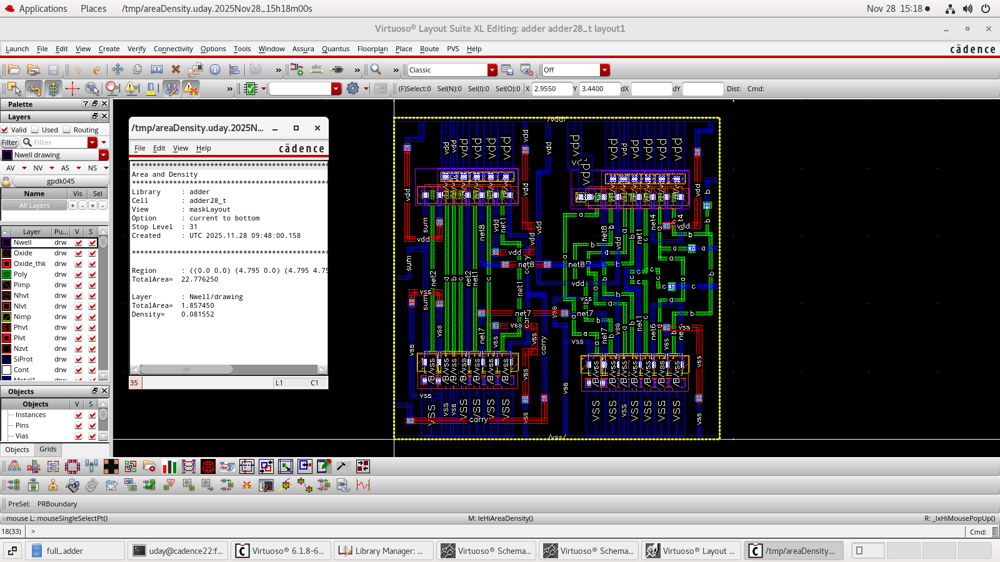
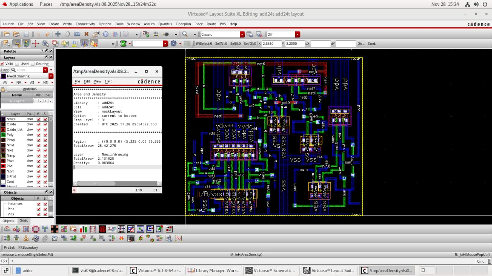
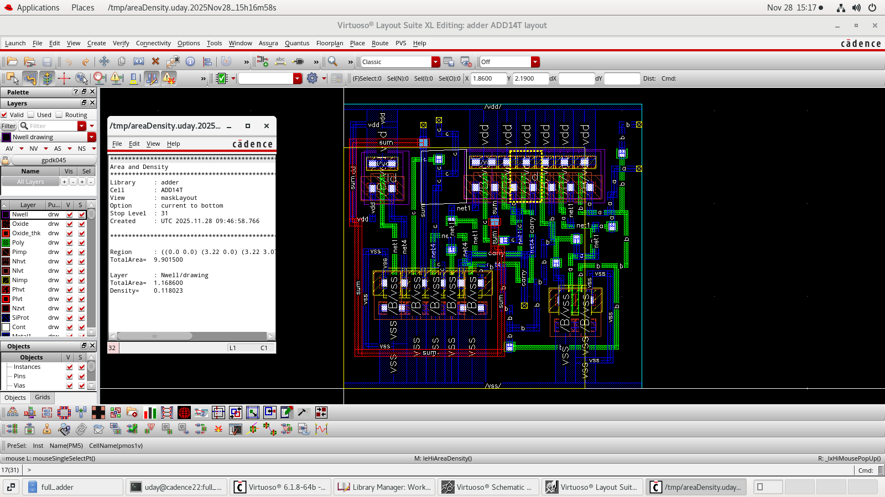

# VLSI Full Adder Design using Cadence Virtuoso

## Project Overview
Design, implementation and performance analysis of 1-bit 
full adder circuits using conventional and hybrid logic 
techniques in 45nm CMOS technology. Three architectures 
are designed, simulated, laid out, and compared for 
power, delay, and silicon area.

---

## Designs Implemented

| Design | Logic Style | Transistor Count |
|--------|------------|-----------------|
| 28T | Conventional CMOS | 28 |
| 24T | Hybrid — PTL + CMOS | 24 |
| 14T | Hybrid — Pass Transistor Logic | 14 |

---

## Tools and Technology

- **Tool:** Cadence Virtuoso (Schematic Editor + ADE)
- **Simulator:** Spectre — Transient analysis
- **Layout:** Cadence Virtuoso Layout Editor
- **Verification:** DRC and LVS using Cadence Verify
- **Parasitic Extraction:** Quantus PEX
- **Technology Node:** 45nm GPDK (Generic Process Design Kit)
- **Supply Voltage:** 1V

---

## Complete VLSI Design Flow
```
Schematic Design
      ↓
Pre-layout Simulation (Power + Delay)
      ↓
Physical Layout Implementation
      ↓
DRC — Design Rule Check (0 errors)
      ↓
LVS — Layout Versus Schematic (Passed)
      ↓
Parasitic Extraction (Quantus)
      ↓
Post-layout Simulation
      ↓
Performance Comparison
```

---

## Schematics

### 28T Full Adder Schematic


### 24T Full Adder Schematic


### 14T Full Adder Schematic


---

## Simulation Waveforms

### 28T Timing Diagram


### 24T Timing Diagram


### 14T Timing Diagram


---

## Physical Layouts

### 28T Layout


### 24T Layout


### 14T Layout



---

## Performance Results


### Proposed Design Results

| Transistor Count | Technology | Area (um²) | Power (uW) | Delay (ns) |
|-----------------|------------|------------|------------|------------|
| 28T | 45nm | 22.77 | 0.212 | 78.42 |
| 24T | 45nm | 25.42 | 0.155 | 86.05 |
| 14T | 45nm | 9.901 | 0.121 | 69.65 |

### Comparison with IEEE Reference

| Transistor Count | Technology | Area (um²) | Power (uW) | Delay (ns) |
|-----------------|------------|------------|------------|------------|
| 28T | 45nm | 24.55 | 0.0228 | 37.45 |
| 24T | 45nm | 27.72 | 0.0309 | 37.42 |
| 14T | 45nm | 12.25 | 0.0431 | 37.43 |

---

## Key Findings

- **14T hybrid design** achieved the smallest silicon area 
  (9.901 um²) and lowest power (0.121 uW) among all three
- **28T conventional design** provides most robust output 
  with full voltage swing — suitable for noise-critical 
  applications
- **24T design** offers balanced trade-off between area, 
  power, and delay — suitable for general purpose arithmetic
- All three designs passed DRC and LVS verification
- Post-layout results confirm correct logic operation for 
  all 8 input combinations

---

## Boolean Expressions

**Sum:** S = A ⊕ B ⊕ C

**Carry:** Cout = AB + BC + AC

**Optimized Carry (used in 24T and 14T):**
Cout = AB + C(A ⊕ B)

---

## Applications

- Arithmetic Logic Units (ALU)
- Digital Signal Processors (DSP)
- Multipliers and Accumulators
- Low-power portable devices
- High-density VLSI systems

---

## University
SDM Institute of Technology, Ujire
Visvesvaraya Technological University, Belagavi
Department of Electronics and Communication Engineering
2025-2026
```
